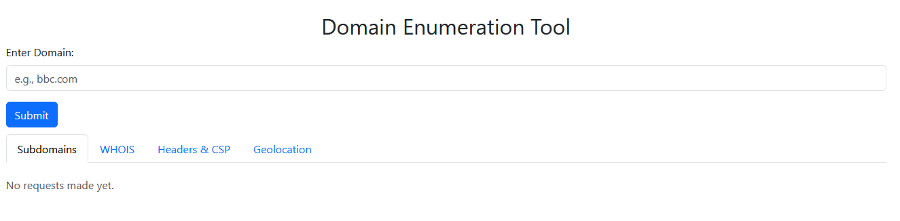

# Domain Analysis Web App

## Overview

This project provides a web-based UI that queries a Flask API to perform domain analysis. The application allows users to input a domain name, and the system will enumerate subdomains, retrieve geolocation data, display WHOIS information, and analyze the page headers, including the Content Security Policy (CSP).

The app is built using a combination of Nginx for serving static content, Flask for the API, and SQLite as the database. The entire application is containerized using Docker.

## Screenshot




## Features

- Subdomain enumeration
- WHOIS lookup
- Geolocation of the domain
- Page headers analysis, including CSP
- Web interface for easy interaction
- Backend powered by Flask API
- Static content served by Nginx

## Prerequisites

- Docker
- Docker Compose (optional for multi-container setup)

## Setup

1. **Clone the repository:**

   ```bash
   git clone https://github.com/c-adrien/domain-analysis-web-app.git
   cd domain-analysis-web-app
   ```

2. **Build and run the Docker containers:**

   Build and run the containers directly with Docker:

   ```bash
   docker build -t domain-analysis-app .
   docker run -p 80:80 domain-analysis-app
   ```

   This will start the web app and the Flask API in the background. The Nginx server will serve the static files, and the Flask API will handle the backend processing.

## Usage

- **Access the web application:**  
  Open a web browser and visit `http://localhost`. 
- **Enter a domain name:**  
  You will be prompted to input a domain (e.g., `bbc.com`).
- **View results:**  
  The system will query the API and display the following results:
  - Subdomains associated with the domain
  - Geolocation data (e.g., country, city, map)
  - WHOIS information
  - HTTP headers including Content Security Policy (CSP)

## Containerization Details

The application is divided into multiple stages to optimize the container size:

1. **Nginx Stage (nginx_stage):**
   - Serves the static HTML files using Nginx.
   - The `index.html` file is placed in the default Nginx directory.

2. **Flask API Stage (flask_stage):**
   - Python 3.9 is used to build the Flask API.
   - Installs necessary libraries, including `whois` and `bind-tools` for querying WHOIS and DNS records.
   - The `requirements.txt` file is used to install Python dependencies.

3. **Final Container (final_stage):**
   - Combines both Nginx (for serving the static content) and Flask (for the API) into a single container.
   - Exposes port 80 for the frontend and port 8888 for internal API access.

## Exposed Ports

- **Frontend (Nginx):** Port 80
- **API (Flask):** Port 8888 (internal access only)

## Configuration

- **Nginx Configuration:**  
  The Nginx configuration file is located at `ui/nginx.conf`. Modify it to adjust server settings or customize the static file serving.

- **Flask Configuration:**  
  The Flask app configuration is in `domain_analysis/app.py`. You can configure the API endpoints or the database setup here if necessary.

- **Database:**  
  The Flask app uses an SQLite database for storing any necessary data (such as WHOIS queries). The database is located in the `/domain_analysis` folder.


## Monitoring and Logs

- You can check logs for both Nginx and Flask by inspecting the Docker container logs:

  ```bash
  docker logs <container_id>
  ```

  Replace `<container_id>` with the ID of your running container.

## Contributing

Contributions are welcome! Please fork the repository and submit a pull request for any improvements, bug fixes, or new features.

## Acknowledgements

A special thanks to [Sublist3r](https://github.com/aboul3la/Sublist3r) for their amazing open-source subdomain enumeration tool, which has been instrumental in powering the subdomain discovery feature of this project.

## License

This project is licensed under the MIT License.